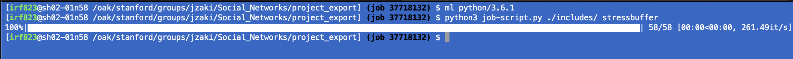
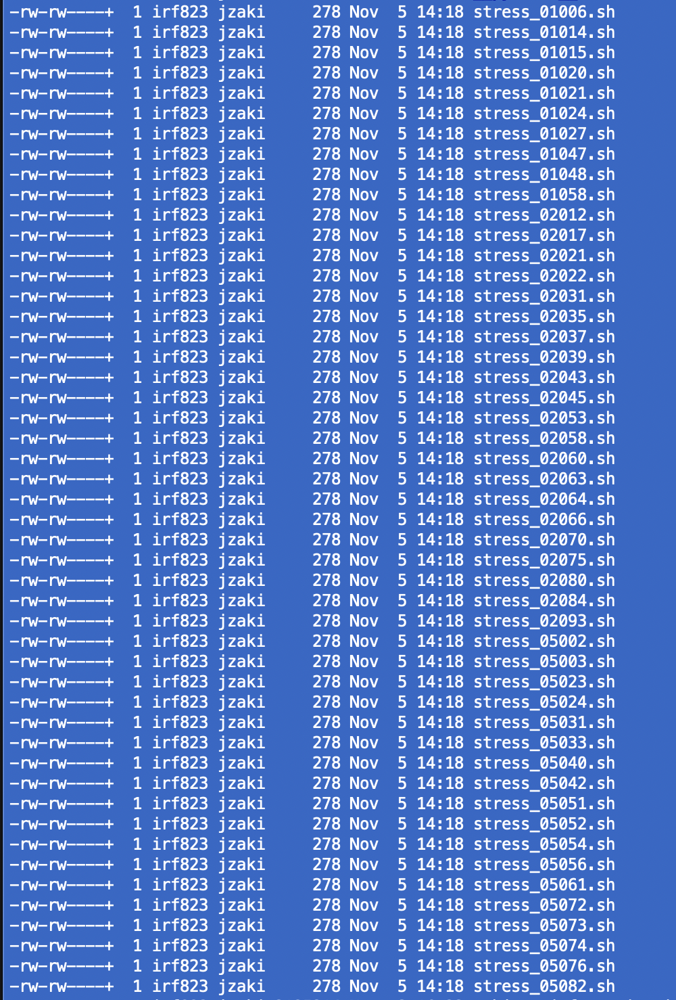
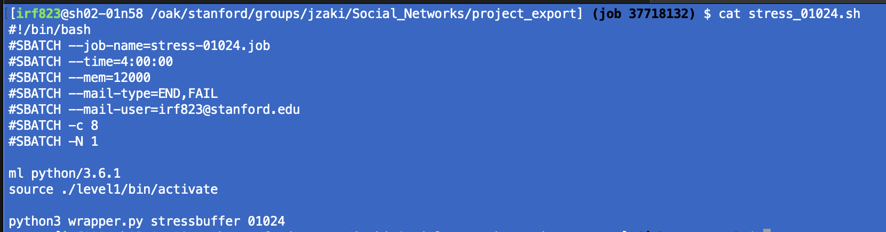
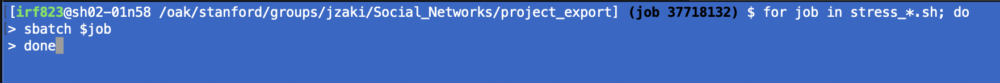

# Deploying on an HPC

Our approach to first-level modeling is to run each subject in parallel - this gives us maximal clarity when jobs fail, and massively speeds up the modeling process overall. Again, we want these scripts to deploy from the **same level** as `communities.py` and `nicursor.py`, as well as the task and subject information JSON files.

## User Notes

1. Run `job-script.py` with two command line arguments: the relative path to your BIDS project, and the functional task name. Please note that these scripts are hard-coded with functional names for our tasks, you should rename yours accordingly

2. This will create a batch of `.sh` job scripts in your current directory. These are subject-specific, and will not include any subs you have excluded in the `task_information.json` file

3. All that's left is a quick bash for loop to submit each job to your SLURM scheduler!

