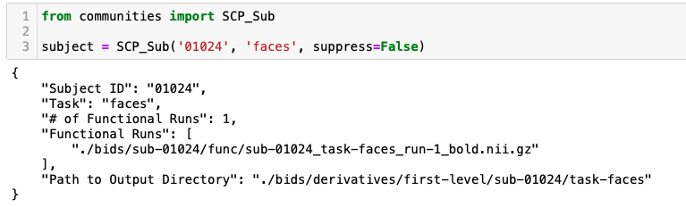

# First Level Analysis

First level analyses were facilitated via an extension of our `SCP_Sub` class (see `communities.py` file). This class extends `nicursor`, a lightweight pointer class for BIDS data.

For more info on `nicursor`, see <a href="https://github.com/IanRFerguson/nicursor" target=_blank>**here**</a>.

## Required at this directory level

* Your BIDS root (e.g., `./bids/`)
* `nicursor.py`
* `communities.py` - This script provides the framework for our `SCP_Sub` class
  
 

* Our SLURM scheduling scripts
  * `deploy_faces.sh`
  * `deploy_socialeval.sh`
  * `deploy_stressbuffer.sh`

 

* Two JSON files specific to this project
  * **scp_task_information.json**
  * **scp_subject_information.json**

## Usage Notes

The `firstlevel.py` script leverages `py-bids` to run a GLM on all complete subjects in the BIDS project root. Run from the command line like this:

`python3 firstlevel.py { BIDS Root } { Task }`