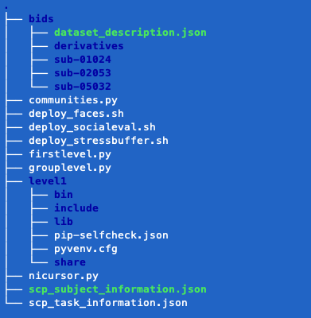

# Stanford Communities Project - fMRI Analysis (2021)

This repository contains pre-processing and analysis scripts for the 2021 SCP neuroimaging project.

## Preprocessing

* We pre-processed our raw data with `fmriprep`
* `MRIQC` was used to confirm data hygiene and exlude participants with excessive motion

## Analysis

* Our analysis pipeline is a custom set of Python objects that each leverage `nilearn` and `nicursor`
  
* `communities.SCP_Sub`: For constructing individual first-level GLMs for a given task
  
* `grouplevel.GroupLevel`: For aggregating first-level GLMs and significance testing

  

`Please note`: First- and group-level scripts are split into different subdirectories in this repository for explanatory purposes. In practice, you'll want all of these scripts to live at the same directory level as your `BIDS` project

